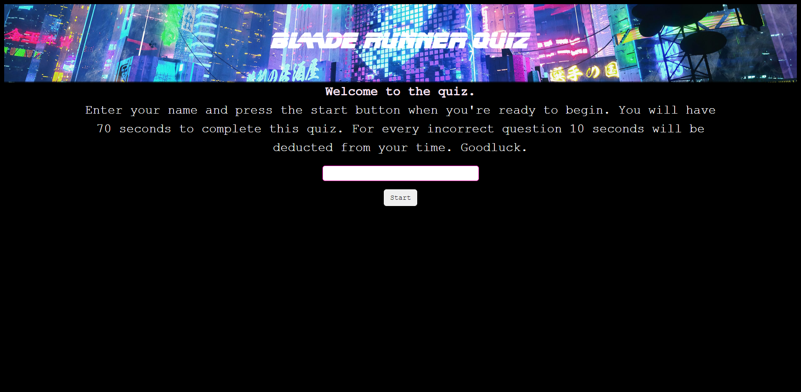
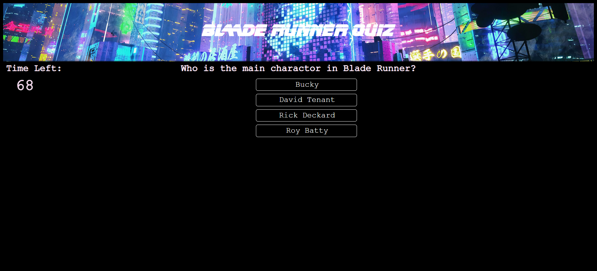
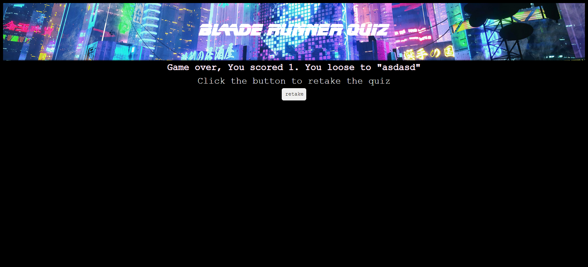

# Quiz assignment

In this project, using DOM manipulation and local storage, I created a timed quiz that pits the user against the high score. upon completion of the quiz, one of three pages will pop up telling you if you won, lost, or tied. If the user wins, there name and score will then replace the previouse high score player. Colors, contrast, and heading structure all meet WCAG AA accessibility requirments, and the quiz has an acceptable user experience. 

